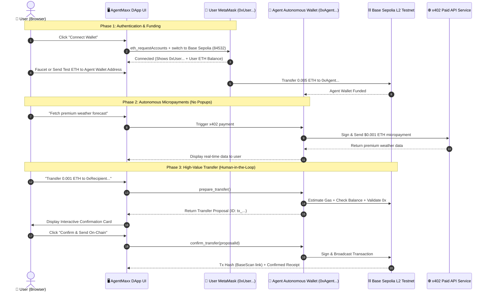
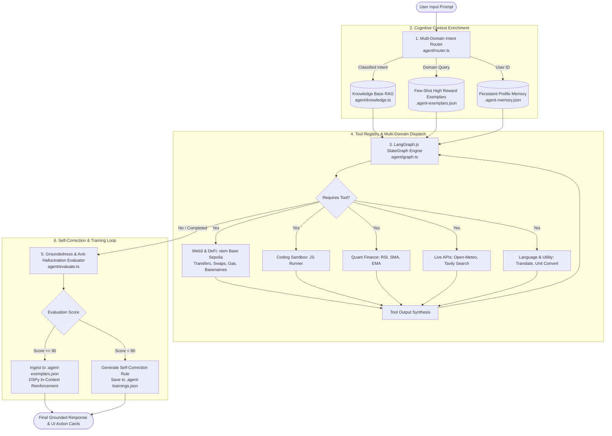

# AgentMaxx — Multi-Domain Cognitive AI Agent & On-Chain Web3 Engine

[](https://nextjs.org/)
[](https://sepolia.basescan.org/)
[](https://langchain-ai.github.io/langgraphjs/)
[](https://ai.google.dev/)
[](https://viem.sh/)
[](LICENSE)

> **AgentMaxx** is an autonomous multi-domain AI agent combining **Base Sepolia L2 Web3 execution**, **Dual-Wallet Architecture**, **LangGraph.js cognitive orchestration**, **Multi-Domain RAG**, and **In-Context Self-Training (DSPy-style reflection & active learning)**.

- **GitHub Repository**: [https://github.com/Khanh-09/Agentmaxxin](https://github.com/Khanh-09/Agentmaxxin)
- **Target Network**: Base Sepolia L2 Testnet (`chainId: 84532`, RPC: `https://sepolia.base.org`)
- **Engine Core**: Google Gemini 3.5 Flash Lite + LangGraph.js StateGraph + viem

---

## 📑 Table of Contents
1. [Architectural Workflows & System Design](#-architectural-workflows--system-design)
   - [Workflow 1: Dual-Wallet Interaction (User Wallet vs. Agent Autonomous Wallet)](#workflow-1-dual-wallet-interaction-user-wallet-vs-agent-autonomous-wallet)
   - [Workflow 2: LangGraph Cognitive StateGraph & Self-Training Pipeline](#workflow-2-langgraph-cognitive-stategraph--self-training-pipeline)
2. [Why Dual-Wallet Architecture?](#-why-dual-wallet-architecture)
3. [Comprehensive Use Case Showcase (7 Major Scenarios)](#-comprehensive-use-case-showcase)
   - [Use Case 1: Human-in-the-Loop Safe Web3 Transfers on Base Sepolia](#use-case-1-human-in-the-loop-safe-web3-transfers-on-base-sepolia)
   - [Use Case 2: Quantitative Finance & Indicator Signals (RSI, SMA, EMA)](#use-case-2-quantitative-finance--indicator-signals-rsi-sma-ema)
   - [Use Case 3: Autonomous x402 Micropayments Protocol](#use-case-3-autonomous-x402-micropayments-protocol)
   - [Use Case 4: DeFi Token Swap Simulation & EIP-1559 Gas Analysis](#use-case-4-defi-token-swap-simulation--eip-1559-gas-analysis)
   - [Use Case 5: Code Sandbox Execution & Verification](#use-case-5-code-sandbox-execution--verification)
   - [Use Case 6: Dynamic Knowledge Base RAG & Active Self-Learning](#use-case-6-dynamic-knowledge-base-rag--active-self-learning)
   - [Use Case 7: Polyglot Multi-Lingual Translation & Unit Conversion](#use-case-7-polyglot-multi-lingual-translation--unit-conversion)
4. [Complete 28 Tools Registry](#-complete-28-tools-registry)
5. [Installation & Quick Start](#-installation--quick-start)
6. [Security & Human-in-the-Loop Safety](#-security--human-in-the-loop-safety)

---

## 🏛️ Architectural Workflows & System Design

### Workflow 1: Dual-Wallet Interaction (User Wallet vs. Agent Autonomous Wallet)



---

### Workflow 2: LangGraph Cognitive StateGraph & Self-Training Pipeline



---

## 🔑 Why Dual-Wallet Architecture?

| Dimension | 🦊 User Wallet (Client MetaMask) | 🤖 Agent Autonomous Wallet (Server-Side) |
| :--- | :--- | :--- |
| **Location & Custody** | Client browser (Self-custodial via MetaMask / Rabby / Coinbase) | Server backend (`.agent-wallet.json` / secure environment) |
| **Primary Purpose** | User identity, sovereignty, and funding source | Autonomous execution, 24/7 background tasks, micropayments |
| **User Experience** | Requires manual MetaMask signature popup for each action | Zero popups; signs programmatic micro-transactions instantly |
| **Use Cases** | Connecting to DApp, funding agent wallet, authorizing high-level governance | x402 HTTP micropayments, automated DeFi rebalancing, gas estimation |
| **Security Boundary** | User controls their primary assets and private keys | Isolated budget-capped testnet wallet; high-value transfers gated by UI confirmation |

---

## 🌟 Comprehensive Use Case Showcase

### Use Case 1: Human-in-the-Loop Safe Web3 Transfers on Base Sepolia
- **Goal**: Prevent AI hallucination or accidental funds loss by enforcing proposal generation before broadcasting transactions.
- **User Prompt**:
  > *"Prepare a transfer of 0.0001 ETH to 0xd8dA6BF26964aF9D7eEd9e03E53415D37aA96045"*
- **Agent Execution Trace**:
  1. `resolve_web3_name` $\rightarrow$ Validates recipient `0xd8dA6BF26964aF9D7eEd9e03E53415D37aA96045` (vitalik.eth).
  2. `prepare_transfer` $\rightarrow$ Verifies agent balance $\ge 0.0001\text{ ETH} + \text{Gas}$, creates proposal `tx_1712...`.
  3. UI generates interactive **Transfer Proposal Card** with "Confirm & Broadcast" button.
  4. User clicks **Confirm** $\rightarrow$ `confirm_transfer` signs transaction and returns live BaseScan link.

```json
{
  "status": "prepared",
  "proposalId": "tx_1712384910_9281",
  "recipient": "0xd8dA6BF26964aF9D7eEd9e03E53415D37aA96045",
  "amountEth": "0.0001",
  "network": "Base Sepolia (Chain ID: 84532)",
  "estimatedGasFeeGwei": "0.0021"
}
```

---

### Use Case 2: Quantitative Finance & Indicator Signals (RSI, SMA, EMA)
- **Goal**: Analyze token price action using math models and provide technical momentum signals.
- **User Prompt**:
  > *"Calculate 14-period RSI and SMA for prices [2500, 2520, 2580, 2600, 2650, 2700, 2780, 2820, 2900, 2950, 3050, 3100, 3200, 3300] and search knowledge base for RSI trading rules."*
- **Agent Execution Trace**:
  1. `calculate_technical_indicators(prices, period=14)` $\rightarrow$ Computes RSI: `88.42`, SMA: `2796.43`, Signal: `OVERBOUGHT`.
  2. `search_knowledge_base(query="RSI")` $\rightarrow$ Retrieves RSI thresholds ($>70$ overbought reversal risk, $<30$ oversold bounce zone).
  3. Synthesizes technical analysis with market risk mitigation strategy.

---

### Use Case 3: Autonomous x402 Micropayments Protocol
- **Goal**: Facilitate machine-to-machine pay-per-request API services without human micro-authorization.
- **User Prompt**:
  > *"Fetch paid satellite weather data for Tokyo using x402 protocol"*
- **Agent Execution Trace**:
  1. Agent detects target endpoint returns `HTTP 402 Payment Required` (Cost: 0.0001 ETH).
  2. `get_paid_weather(city="Tokyo")` $\rightarrow$ Agent wallet signs cryptographic authorization payload.
  3. Transaction settles on Base Sepolia L2 and unlocks encrypted weather radar feed.

---

### Use Case 4: DeFi Token Swap Simulation & EIP-1559 Gas Analysis
- **Goal**: Estimate slippage, liquidity pool fees, and live network gas before committing on-chain capital.
- **User Prompt**:
  > *"Simulate swapping 0.5 ETH for USDC on Base Sepolia and check current gas fees"*
- **Agent Execution Trace**:
  1. `get_crypto_price(tokens=["ethereum", "usd-coin"])` $\rightarrow$ ETH = $3,450.00 USD.
  2. `simulate_token_swap(fromToken="ETH", toToken="USDC", amount=0.5, slippagePercent=0.5)` $\rightarrow$ Output: `1720.55 USDC` (after 0.3% Uniswap v3 fee).
  3. `estimate_gas_and_fees()` $\rightarrow$ Base Fee: `0.0015 Gwei`, Priority Fee: `1.0 Gwei`, Total Estimated Cost: `< $0.001 USD`.

---

### Use Case 5: Code Sandbox Execution & Verification
- **Goal**: Execute algorithms, verify data transforms, and run unit tests in a safe JavaScript VM sandbox.
- **User Prompt**:
  > *"Write and execute a JavaScript function to compute the Fibonacci sequence up to n=15 and verify execution time."*
- **Agent Execution Trace**:
  1. `execute_javascript(code="function fib(n){let a=0,b=1,res=[0,1];for(let i=2;i<n;i++){let c=a+b;res.push(c);a=b;b=c;}return res;} fib(15);")`.
  2. Sandbox returns: `[0, 1, 1, 2, 3, 5, 8, 13, 21, 34, 55, 89, 144, 233, 377]` in `0.42ms`.
  3. Agent presents verified code snippet and performance telemetry.

---

### Use Case 6: Dynamic Knowledge Base RAG & Active Self-Learning
- **Goal**: Ingest new concepts dynamically, store verified traces (DSPy pattern), and correct future agent behavior.
- **User Prompt**:
  > *"Learn new fact: Base Sepolia uses OP Stack Fault Proofs and Chain ID is 84532, then show me your training intelligence"*
- **Agent Execution Trace**:
  1. `learn_new_knowledge(title="Base Sepolia OP Stack", content="...", category="web3", tags=["base", "op-stack"])`.
  2. Stored in `.agent-knowledge-base.json`.
  3. `get_training_intelligence()` $\rightarrow$ Reports 100% accuracy benchmark, active exemplars count, and reflection learnings.

---

### Use Case 7: Polyglot Multi-Lingual Translation & Unit Conversion
- **Goal**: Translate complex technical and smart contract documentation across languages and convert metric/crypto units.
- **User Prompt**:
  > *"Convert 2,500,000,000 Gwei to ETH and translate 'Smart contract deployed successfully on Base Sepolia' into Vietnamese, Japanese, and French."*
- **Agent Execution Trace**:
  1. `convert_units(value=2500000000, fromUnit="gwei", toUnit="eth", category="crypto_gas")` $\rightarrow$ `2.5 ETH`.
  2. `translate_text(text="Smart contract deployed successfully on Base Sepolia", targetLanguage="Vietnamese")` $\rightarrow$ `"Hợp đồng thông minh đã được triển khai thành công trên Base Sepolia"`.
  3. Polyglot output formatted in a clean localized comparison matrix.

---

## 🛠️ Complete 28 Tools Registry

| Domain | Tool Name | Input Parameters | Key Capabilities |
| :--- | :--- | :--- | :--- |
| **Web3** | `get_wallet_info` | None | Returns Agent Wallet 0x address, ETH balance, Base Sepolia RPC health, and faucet links. |
| **Web3** | `prepare_transfer` | `recipient`, `amountEth`, `memo` | Validates recipient, balances, calculates gas, and creates a secure proposal card. |
| **Web3** | `confirm_transfer` | `proposalId` | Signs and broadcasts the pending proposal to Base Sepolia L2 via viem. |
| **Web3** | `get_transaction_status` | `txHash` | Fetches block confirmation, gas consumed, and status from Base Sepolia RPC. |
| **Web3** | `get_erc20_balance` | `tokenAddress`, `walletAddress?` | Queries standard ERC-20 `balanceOf` and `decimals` on Base Sepolia. |
| **Web3** | `simulate_token_swap` | `fromToken`, `toToken`, `amount`, `slippagePercent?` | Calculates exact DEX swap return, 0.3% pool fee, and minimum received amount. |
| **Web3** | `estimate_gas_and_fees` | None | Live Base Sepolia EIP-1559 base fee, priority fee, and transfer cost in USD. |
| **Web3** | `resolve_web3_name` | `nameOrAddress` | Resolves Basenames (`.base.eth`), ENS (`.eth`), and validates 0x addresses. |
| **Web3** | `read_smart_contract` | `contractAddress` | Reads bytecode, verified status, and provides direct BaseScan explorer links. |
| **Web3** | `get_faucet_links` | `network?` | Returns authenticated faucets for Base Sepolia, Ethereum Sepolia, and Superchain. |
| **Web3** | `get_crypto_price` | `token` | Live real-time cryptocurrency prices in USD via CoinGecko. |
| **Web3** | `get_network_info` | None | Base Sepolia chain ID, latest block height, RPC endpoint, and network latency. |
| **x402** | `get_paid_weather` | `city` | Autonomous x402 HTTP micropayment client with on-chain cryptographic settlement. |
| **RAG** | `search_knowledge_base` | `query`, `category?`, `limit?` | Searches internal multi-domain knowledge base with category filtering. |
| **RAG** | `learn_new_knowledge` | `title`, `content`, `category`, `tags` | Dynamically teaches the agent new technical docs and persists to disk. |
| **Learning** | `get_training_intelligence` | None | Returns self-training statistics, high-reward DSPy exemplars, and reflection rules. |
| **Coding** | `execute_javascript` | `code` | Executes JavaScript/TypeScript algorithms safely in an isolated VM sandbox. |
| **Finance** | `calculate_technical_indicators` | `prices`, `period?` | Computes 14-period RSI, Simple Moving Average (SMA), and Exponential Moving Average (EMA). |
| **Utility** | `convert_units` | `value`, `fromUnit`, `toUnit`, `category` | Converts Celsius/Fahrenheit, Wei/Gwei/ETH, Storage (MB/GB/TB), and Distances. |
| **Language** | `translate_text` | `text`, `targetLanguage`, `tone?` | Polyglot multi-lingual translation (Vietnamese, English, Japanese, Chinese, French, Spanish). |
| **Tasks** | `manage_task_todo` | `action`, `taskTitle?`, `taskId?`, `priority?` | Manages developer task workflows, tracking, and milestones. |
| **Live API** | `get_weather` | `city` | Real-time global weather via Open-Meteo live geocoding & forecast API. |
| **Web** | `get_web_search` | `query`, `numResults?` | Live web research engine with verified external citations. |
| **Web** | `extract_web_page` | `url` | Web scraper and markdown converter for live URLs. |
| **Memory** | `remember_user_fact` | `fact`, `category?` | Stores persistent facts about the user into long-term agent memory. |
| **Memory** | `get_user_memories` | None | Retrieves all remembered facts and profile context. |
| **Creative** | `generate_creative_brief` | `topic`, `format?` | Generates creative production briefs, themes, and audio tracklists. |
| **Math** | `calculate` | `expression` | Mathematical expression evaluator. |

---

## 🚀 Installation & Quick Start

### 1. Prerequisites
- **Node.js**: `v18.17.0+` or `v20.x`
- **Package Manager**: `npm` or `pnpm`
- **Google Gemini API Key**: [Get one for free at Google AI Studio](https://aistudio.google.com/)

### 2. Clone and Install
```bash
git clone https://github.com/Khanh-09/Agentmaxxin.git
cd Agentmaxxin/my-agent
npm install
```

### 3. Environment Variables
Create a `.env` file in `my-agent/`:
```env
GEMINI_API_KEY=your_gemini_api_key_here
GEMINI_MODEL=gemini-3.5-flash-lite
```

### 4. Run Development Server
```bash
npm run dev
```
Open [http://localhost:3000](http://localhost:3000) to launch the AgentMaxx DApp interface.

---

## 🔒 Security & Human-in-the-Loop Safety

1. **Private Key Isolation**: The Agent Autonomous Wallet private key (`.agent-wallet.json`) resides strictly server-side and is never sent to the browser.
2. **User Sovereign Custody**: User funds remain in their own MetaMask wallet; the user only funds the agent with small testnet amounts as needed.
3. **Two-Phase Transfer Verification**: No ETH/ERC-20 transfer is broadcast without generating a proposal `prepare_transfer` and receiving explicit user confirmation in the UI.
4. **Git Safeguards**: All wallet secrets, memory files, and training logs are strictly excluded via `.gitignore`.

---

## 📜 License & Acknowledgments
- **License**: MIT © 2026 Khanh-09 / Rise In Agentmaxxing
- **Ecosystem**: Base Sepolia L2 (Coinbase), Google DeepMind Gemini, LangChain / LangGraph.js, viem.
