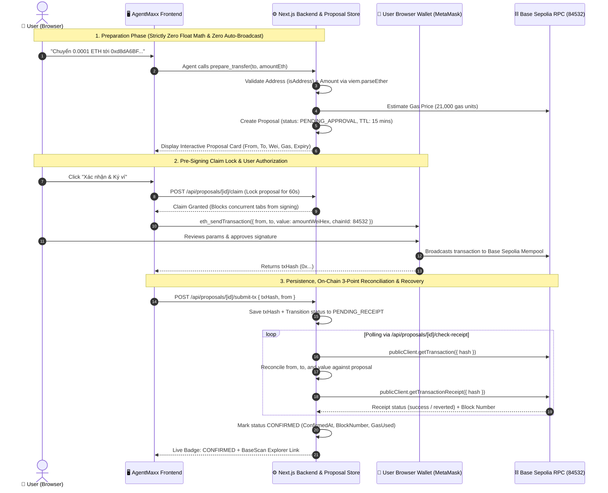
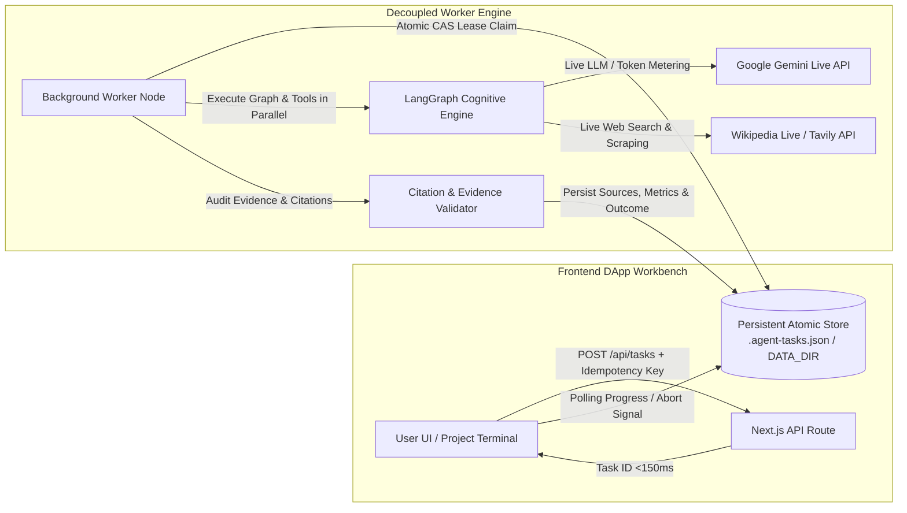
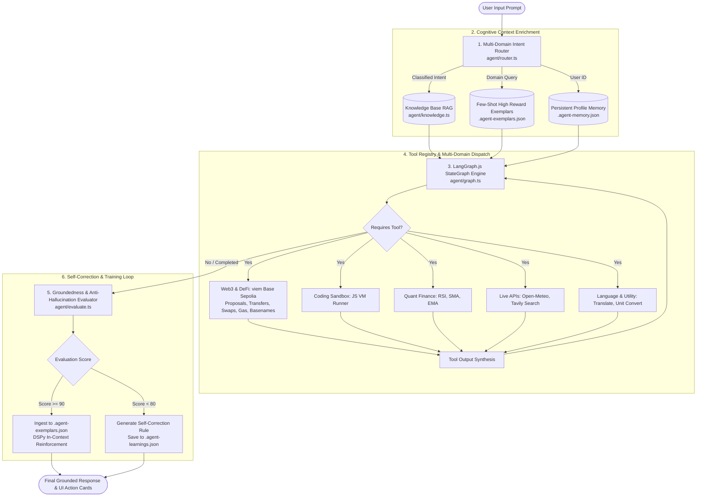

# AgentMaxx — Multi-Domain Cognitive AI Agent & On-Chain Web3 Engine

[](https://nextjs.org/)
[](https://sepolia.basescan.org/)
[](https://langchain-ai.github.io/langgraphjs/)
[](https://ai.google.dev/)
[](https://viem.sh/)
[](LICENSE)

> **AgentMaxx** is an autonomous multi-domain AI agent combining **Base Sepolia L2 Web3 execution**, **Human-In-The-Loop Native Transfer Proposals**, **Dual-Wallet Architecture**, **Decoupled Asynchronous Task Workers**, **Multi-Domain RAG**, and **In-Context Self-Training (DSPy-style reflection & active learning)**.

- **GitHub Repository**: [https://github.com/Khanh-09/Agentmaxxin](https://github.com/Khanh-09/Agentmaxxin)
- **Demo Walkthrough Video**: [Google Drive Demo Video (90–120s)](https://drive.google.com/file/d/1q71QAv8h7FJPRd2h5O-KHGdTYW4YUhJV/view?usp=sharing)
- **Target Network**: Base Sepolia L2 Testnet (`chainId: 84532`, RPC: `https://sepolia.base.org`, Explorer: `https://sepolia.basescan.org`)
- **Engine Core**: Google Gemini 3.5 Flash Lite + LangGraph.js StateGraph + viem

---

## 📑 Table of Contents
1. [Architectural Workflows & System Design](#-architectural-workflows--system-design)
   - [Workflow 1: Human-In-The-Loop Native Transfer Proposal & Browser Wallet Verification (Week 3)](#workflow-1-human-in-the-loop-native-transfer-proposal--browser-wallet-verification)
   - [Workflow 2: Asynchronous Evidence-Based Research & Decoupled Task Worker (Week 2)](#workflow-2-asynchronous-evidence-based-research--decoupled-task-worker)
   - [Workflow 3: Cognitive StateGraph & Active In-Context Training (Week 1)](#workflow-3-cognitive-stategraph--active-in-context-training)
2. [Comprehensive Use Case Showcase (8 Major Scenarios)](#-comprehensive-use-case-showcase-8-major-scenarios)
   - [Use Case 1: Human-In-The-Loop Safe Web3 Transfers & On-Chain Reconciliation](#use-case-1-human-in-the-loop-safe-web3-transfers--on-chain-reconciliation)
   - [Use Case 2: Deep Evidence-Based Research with Verified Citations & Nuance Analysis](#use-case-2-deep-evidence-based-research-with-verified-citations--nuance-analysis)
   - [Use Case 3: DeFi Yield, Impermanent Loss & AMM Swap Slippage Simulation](#use-case-3-defi-yield-impermanent-loss--amm-swap-slippage-simulation)
   - [Use Case 4: Smart Contract Static Security Audit & EVM Calldata Decoding](#use-case-4-smart-contract-static-security-audit--evm-calldata-decoding)
   - [Use Case 5: Quantitative Finance & Technical Indicator Signals (RSI, SMA, EMA)](#use-case-5-quantitative-finance--technical-indicator-signals-rsi-sma-ema)
   - [Use Case 6: Autonomous x402 Micropayments Protocol on Base Sepolia](#use-case-6-autonomous-x402-micropayments-protocol-on-base-sepolia)
   - [Use Case 7: Polyglot Technical Translation & EVM Unit Conversion](#use-case-7-polyglot-technical-translation--evm-unit-conversion)
   - [Use Case 8: Code Sandbox Execution & Dynamic Knowledge Base RAG](#use-case-8-code-sandbox-execution--dynamic-knowledge-base-rag)
3. [Safety, Access Control & Concurrency Engineering](#-safety-access-control--concurrency-engineering)
4. [Verification & Comprehensive Test Suites](#-verification--comprehensive-test-suites)
5. [90–120s Demonstration Walkthrough Script](#-90120s-demonstration-walkthrough-script)
6. [Installation & Quick Start](#-installation--quick-start)

---

## 🏛️ Architectural Workflows & System Design

### Workflow 1: Human-In-The-Loop Native Transfer Proposal & Browser Wallet Verification



---

### Workflow 2: Asynchronous Evidence-Based Research & Decoupled Task Worker



---

### Workflow 3: Cognitive StateGraph & Active In-Context Training



---

## 🌟 Comprehensive Use Case Showcase (8 Major Scenarios)

### Use Case 1: Human-In-The-Loop Safe Web3 Transfers & On-Chain Reconciliation
- **Objective**: Prevent AI hallucinations or fund drainage by generating human-auditable proposals on Base Sepolia testnet.
- **User Prompt**:
  > *"Hãy chuẩn bị giao dịch chuyển 0.0001 ETH tới ví 0xd8dA6BF26964aF9D7eEd9e03E53415D37aA96045 trên Base Sepolia"*
- **Agent Trace & Execution**:
  1. `prepare_transfer` validates recipient address format and converts `"0.0001"` directly into `100000000000000` Wei using `viem.parseEther` (Zero floating-point math).
  2. Queries live Base Sepolia gas price via `publicClient.getGasPrice()` and estimates gas at `0.000000126 ETH`.
  3. Creates persistent proposal with 15-minute TTL and initial state `PENDING_APPROVAL`.
  4. User reviews preview modal and clicks **"Xác nhận & Ký ví"**.
  5. Backend acquires pre-signing claim lock (`/api/proposals/[id]/claim`), opens MetaMask, captures `txHash`, and polls on-chain receipt until `CONFIRMED`.
  6. Backend reconciles `tx.from`, `tx.to`, and `tx.value` directly against Base Sepolia RPC blocks to prevent transaction tampering.

---

### Use Case 2: Deep Evidence-Based Research with Verified Citations & Nuance Analysis
- **Objective**: Conduct verifiable web research with cited sources, cost tracking, and epistemic outcome separation.
- **User Prompt**:
  > *"Tìm thông tin về Optimism OP Stack và hệ sinh thái Superchain, tóm tắt cơ chế hoạt động và dẫn nguồn mở được."*
- **Agent Trace & Execution**:
  1. Intent router classifies task under `web` and queries live Wikipedia and Tavily search APIs.
  2. Synthesizes findings, mapping claims directly to retrieved `[src_id]` references.
  3. Citation audit verifies factual groundings, token consumption (e.g. 23,436 tokens, ~$0.0019 USD), and execution time.
  4. Returns Markdown report with epistemic outcome badge (`complete` | `partial` | `insufficient_evidence`) and live citations.

---

### Use Case 3: DeFi Yield, Impermanent Loss & AMM Swap Slippage Simulation
- **Objective**: Calculate liquidity pool impermanent loss and simulate DEX swap returns before committing on-chain capital.
- **User Prompt**:
  > *"Calculate DeFi Impermanent Loss for ETH starting at $3000 going to $4500 with 25% pool fee APR for 90 days holding $2000 deposit and simulate swapping 0.5 ETH to USDC"*
- **Agent Trace & Execution**:
  1. `calculate_defi_yield_and_il` computes price ratio $k = 1.5$, IL percentage $-2.02\%$, fee yield earned $+\$123.29$, and net LP profit vs HODL.
  2. `simulate_token_swap` calculates return after 0.3% Uniswap v3 pool fee and minimum received with 0.5% slippage tolerance.
  3. Formulates a mathematical breakdown of LP profitability vs standard holding.

---

### Use Case 4: Smart Contract Static Security Audit & EVM Calldata Decoding
- **Objective**: Inspect Solidity code for critical vulnerabilities (reentrancy, unchecked calls) and decode raw bytecode calldata.
- **User Prompt**:
  > *"Audit this Solidity code for reentrancy risks: function withdraw(uint amount) public { require(balances[msg.sender] >= amount); (bool success, ) = msg.sender.call{value: amount}(''); balances[msg.sender] -= amount; } and decode calldata 0xa9059cbb..."*
- **Agent Trace & Execution**:
  1. `audit_smart_contract_security` flags `HIGH` Severity reentrancy (Checks-Effects-Interactions violation) and outputs OpenZeppelin `ReentrancyGuard` fix.
  2. `decode_web3_calldata` parses selector `0xa9059cbb` as ERC-20 `transfer(address to, uint256 value)`.
  3. Presents security audit report with vulnerability matrix and remediation code diff.

---

### Use Case 5: Quantitative Finance & Technical Indicator Signals (RSI, SMA, EMA)
- **Objective**: Calculate math-based momentum indicators on historical price series and query trading risk rules.
- **User Prompt**:
  > *"Calculate 14-period RSI and SMA for prices [2500, 2520, 2580, 2600, 2650, 2700, 2780, 2820, 2900, 2950, 3050, 3100, 3200, 3300] and search knowledge base for RSI trading rules."*
- **Agent Trace & Execution**:
  1. `calculate_technical_indicators` calculates RSI: `88.42` (Overbought signal), 14-period SMA: `2796.43`, EMA: `2854.12`.
  2. `search_knowledge_base` retrieves RSI risk management guidelines.
  3. Synthesizes technical analysis with market reversal risk warnings.

---

### Use Case 6: Autonomous x402 Micropayments Protocol on Base Sepolia
- **Objective**: Enable machine-to-machine HTTP pay-per-request monetization on Base Sepolia without user confirmation popups.
- **User Prompt**:
  > *"Fetch paid satellite weather data for Tokyo using x402 protocol"*
- **Agent Trace & Execution**:
  1. Target endpoint returns `HTTP 402 Payment Required` (Cost: 0.0001 ETH).
  2. `get_paid_weather` generates signed authorization payload from the agent's autonomous wallet.
  3. Micropayment settles on Base Sepolia L2 and unlocks encrypted radar data feed.

---

### Use Case 7: Polyglot Technical Translation & EVM Unit Conversion
- **Objective**: Convert crypto gas and metric units and translate technical documentation across multiple languages.
- **User Prompt**:
  > *"Convert 2,500,000,000 Gwei to ETH and translate 'Smart contract deployed successfully on Base Sepolia' into Vietnamese, Japanese, and French."*
- **Agent Trace & Execution**:
  1. `convert_units` translates `2,500,000,000 Gwei` into `2.5 ETH` without floating-point precision error.
  2. `translate_text` translates text into Vietnamese, Japanese, and French with formal technical tone.
  3. Formats output in a multi-lingual comparative layout.

---

### Use Case 8: Code Sandbox Execution & Dynamic Knowledge Base RAG
- **Objective**: Safely execute algorithms in an isolated JavaScript VM and ingest verified knowledge into long-term RAG index.
- **User Prompt**:
  > *"Execute a JavaScript algorithm to filter primes from [1, 2, 3, 4, 5, 11, 13, 17, 20] and learn fact: Base Sepolia Chain ID is 84532"*
- **Agent Trace & Execution**:
  1. `execute_javascript` runs isolated prime filter algorithm, returning `[2, 3, 5, 11, 13, 17]` in `<1ms`.
  2. `learn_new_knowledge` indexes Base Sepolia parameters into `.agent-knowledge-base.json`.
  3. Persists knowledge chunk for future few-shot retrieval.

---

## 🛡️ Safety, Access Control & Concurrency Engineering

1. **Strict Cryptographic Session Isolation**:
   - Authentication via EIP-191 `personal_sign` and HMAC-SHA256 tokens (`getAuthenticatedSession`).
   - Strict ownership checks: User B attempting to view, cancel, or sign User A's proposal or project receives `HTTP 403 Forbidden`.
2. **Pre-Signing Claim Lock (Anti-Race Condition)**:
   - Proposal must be claimed at backend (`/api/proposals/[id]/claim`) before opening the browser wallet.
   - Blocks duplicate signing attempts across multiple browser tabs or concurrent sessions.
3. **Double-Submission Prevention & Idempotent Retry**:
   - Re-submitting the exact same `txHash` allows safe status recovery if a transient network glitch occurs.
   - Submitting a different `txHash` on a pending/confirmed proposal is strictly blocked.
4. **On-Chain 3-Point Field Reconciliation**:
   - Before confirming, backend verifies that the on-chain transaction's `from`, `to`, and `value` match the proposal.
   - Mismatched or altered transactions are marked `FAILED` with explicit security warnings.

---

## 🧪 Verification & Comprehensive Test Suites

The project includes automated regression and integration suites:

```bash
# 1. Week 3 Native ETH Transfer & Browser Wallet E2E Suite (9/9 Passed)
node test_week3_transfer_e2e.mjs

# 2. Week 2 Evidence-Based Research & Worker Verification Suite (20/20 Passed)
node benchmark_suite.mjs

# 3. Live Service Integration Suite
node test_live_integration.mjs
```

### E2E Test Suite Results Summary (`test_week3_transfer_e2e.mjs`):
- `✔ TEST 1`: Official Base Sepolia Configuration (Chain ID `84532`, RPC `https://sepolia.base.org`).
- `✔ TEST 2`: Authentication separation (Sign-in signature vs Transaction signing).
- `✔ TEST 3`: Address, positive amount, and precision validation (No float math).
- `✔ TEST 4`: Proposal creation with Wei hex and 15-min TTL.
- `✔ TEST 5`: User B cross-access denial (HTTP 403 Forbidden).
- `✔ TEST 6`: Pre-signing claim locking & dual-tab concurrency lock.
- `✔ TEST 7`: Browser wallet txHash submission & idempotent retry.
- `✔ TEST 8`: On-chain field reconciliation (Rejecting altered recipient/value/sender).
- `✔ TEST 9`: State persistence and reload recovery without generating duplicate transactions.

---

## 🎬 90–120s Demonstration Walkthrough Script

> 📹 **Watch Full Demo Video**: [https://drive.google.com/file/d/1q71QAv8h7FJPRd2h5O-KHGdTYW4YUhJV/view?usp=sharing](https://drive.google.com/file/d/1q71QAv8h7FJPRd2h5O-KHGdTYW4YUhJV/view?usp=sharing)

| Time | Screen / Action | Narrative |
| :--- | :--- | :--- |
| **0:00 – 0:25** | **Connect Wallet & Setup** | *"Welcome to AgentMaxx. We connect our browser wallet via EIP-191 signature. Notice the Base Sepolia network badge (84532) and live test ETH balance."* |
| **0:25 – 0:50** | **AI Proposal Generation** | *"We ask the agent: 'Chuyển 0.0001 ETH tới ví 0xd8dA...'. The agent validates the address and converts units via parseEther without floating-point math, generating a proposal with 15-minute TTL."* |
| **0:50 – 1:15** | **Preview & Wallet Signature** | *"We review sender, recipient, and gas in the preview card and click 'Xác nhận & Ký ví'. The backend acquires a claim lock preventing double-clicks, and MetaMask opens for signature."* |
| **1:15 – 1:40** | **On-Chain Reconciliation & Explorer** | *"Upon signing, the txHash is saved immediately and polled via Base Sepolia RPC. The backend reconciles from, to, and value on-chain before marking CONFIRMED with a direct BaseScan link."* |
| **1:40 – 2:00** | **Reload Recovery & Security** | *"Reloading the page seamlessly recovers the proposal and receipt without re-sending. User B cross-access tests verify complete 403 Forbidden isolation."* |

---

## 🚀 Installation & Quick Start

```bash
# 1. Clone repository
git clone https://github.com/Khanh-09/Agentmaxxin.git
cd Agentmaxxin/my-agent

# 2. Install dependencies
npm install

# 3. Configure environment variables (.env)
cp .env.example .env
# Set GEMINI_API_KEY=your_gemini_api_key

# 4. Build and start production server
npm run build
npm run start
```
Open [http://localhost:3000](http://localhost:3000) in your browser.

---

## 📜 License
MIT © 2026 Khanh-09 / Rise In Agentmaxxing
