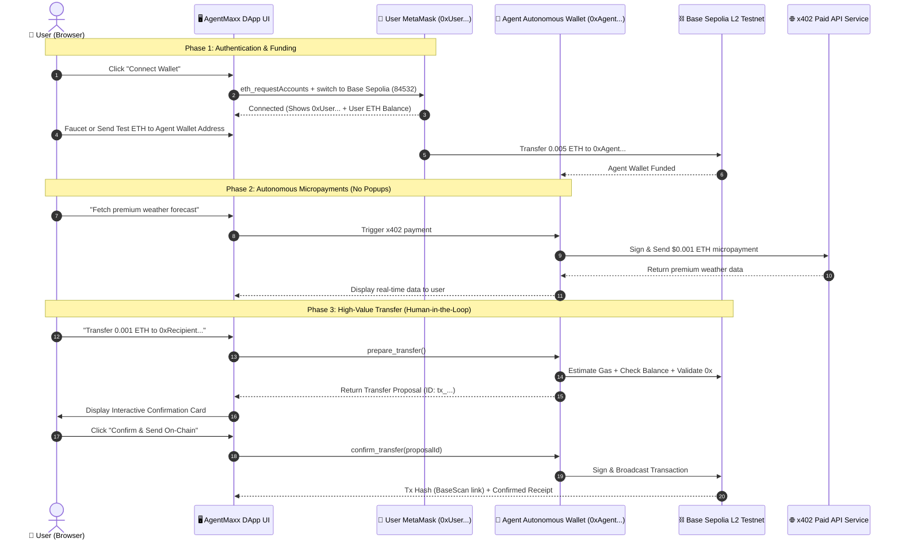
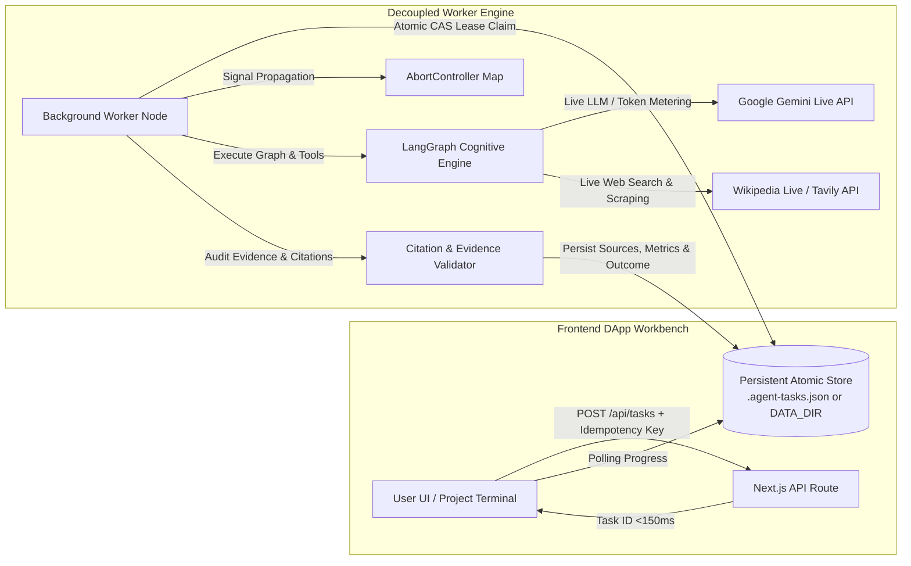

# AgentMaxx — Multi-Domain Cognitive AI Agent & On-Chain Web3 Engine

[](https://nextjs.org/)
[](https://sepolia.basescan.org/)
[](https://langchain-ai.github.io/langgraphjs/)
[](https://ai.google.dev/)
[](https://viem.sh/)
[](LICENSE)

> **AgentMaxx** is an autonomous multi-domain AI agent combining **Base Sepolia L2 Web3 execution**, **Dual-Wallet Architecture**, **LangGraph.js cognitive orchestration**, **Multi-Domain RAG**, and **In-Context Self-Training (DSPy-style reflection & active learning)**.

- **GitHub Repository**: [https://github.com/Khanh-09/Agentmaxxin](https://github.com/Khanh-09/Agentmaxxin)
- **Target Network**: Base Sepolia L2 Testnet (`chainId: 84532`, RPC: `https://sepolia.base.org`)
- **Engine Core**: Google Gemini 3.5 Flash Lite + LangGraph.js StateGraph + viem

---

## 📑 Table of Contents
1. [Architectural Workflows & System Design](#-architectural-workflows--system-design)
   - [Workflow 1: Dual-Wallet Interaction (User Wallet vs. Agent Autonomous Wallet)](#workflow-1-dual-wallet-interaction-user-wallet-vs-agent-autonomous-wallet)
   - [Workflow 2: LangGraph Cognitive StateGraph & Self-Training Pipeline](#workflow-2-langgraph-cognitive-stategraph--self-training-pipeline)
2. [Why Dual-Wallet Architecture?](#-why-dual-wallet-architecture)
3. [Comprehensive Use Case Showcase (8 Major Scenarios)](#-comprehensive-use-case-showcase)
   - [Use Case 1: Human-in-the-Loop Safe Web3 Transfers on Base Sepolia](#use-case-1-human-in-the-loop-safe-web3-transfers-on-base-sepolia)
   - [Use Case 2: Quantitative Finance & Indicator Signals (RSI, SMA, EMA)](#use-case-2-quantitative-finance--indicator-signals-rsi-sma-ema)
   - [Use Case 3: Autonomous x402 Micropayments Protocol](#use-case-3-autonomous-x402-micropayments-protocol)
   - [Use Case 4: DeFi Token Swap Simulation & EIP-1559 Gas Analysis](#use-case-4-defi-token-swap-simulation--eip-1559-gas-analysis)
   - [Use Case 5: Code Sandbox Execution & Verification](#use-case-5-code-sandbox-execution--verification)
   - [Use Case 6: Dynamic Knowledge Base RAG & Active Self-Learning](#use-case-6-dynamic-knowledge-base-rag--active-self-learning)
   - [Use Case 7: Polyglot Multi-Lingual Translation & Unit Conversion](#use-case-7-polyglot-multi-lingual-translation--unit-conversion)
   - [Use Case 8: Smart Contract Security Audit & EVM Calldata Decoding](#use-case-8-smart-contract-security-audit--evm-calldata-decoding)
4. [Complete 32 Tools Registry](#-complete-32-tools-registry)
5. [Installation & Quick Start](#-installation--quick-start)
6. [Security & Human-in-the-Loop Safety](#-security--human-in-the-loop-safety)

---

## 🏛️ Architectural Workflows & System Design

### Workflow 1: Dual-Wallet Interaction (User Wallet vs. Agent Autonomous Wallet)



---

### Workflow 2: LangGraph Cognitive StateGraph & Self-Training Pipeline


---

## 🔑 Why Dual-Wallet Architecture?

| Dimension | 🦊 User Wallet (Client MetaMask) | 🤖 Agent Autonomous Wallet (Server-Side) |
| :--- | :--- | :--- |
| **Location & Custody** | Client browser (Self-custodial via MetaMask / Rabby / Coinbase) | Server backend (`.agent-wallet.json` / secure environment) |
| **Primary Purpose** | User identity, sovereignty, and funding source | Autonomous execution, 24/7 background tasks, micropayments |
| **User Experience** | Requires manual MetaMask signature popup for each action | Zero popups; signs programmatic micro-transactions instantly |
| **Use Cases** | Connecting to DApp, funding agent wallet, authorizing high-level governance | x402 HTTP micropayments, automated DeFi rebalancing, gas estimation |
| **Security Boundary** | User controls their primary assets and private keys | Isolated budget-capped testnet wallet; high-value transfers gated by UI confirmation |

---

## 🌟 Comprehensive Use Case Showcase

### Use Case 1: Human-in-the-Loop Safe Web3 Transfers on Base Sepolia
- **Goal**: Prevent AI hallucination or accidental funds loss by enforcing proposal generation before broadcasting transactions.
- **User Prompt**:
  > *"Prepare a transfer of 0.0001 ETH to 0xd8dA6BF26964aF9D7eEd9e03E53415D37aA96045"*
- **Agent Execution Trace**:
  1. `resolve_web3_name` $\rightarrow$ Validates recipient `0xd8dA6BF26964aF9D7eEd9e03E53415D37aA96045` (vitalik.eth).
  2. `prepare_transfer` $\rightarrow$ Verifies agent balance $\ge 0.0001\text{ ETH} + \text{Gas}$, creates proposal `tx_1712...`.
  3. UI generates interactive **Transfer Proposal Card** with "Confirm & Broadcast" button.
  4. User clicks **Confirm** $\rightarrow$ `confirm_transfer` signs transaction and returns live BaseScan link.

```json
{
  "status": "prepared",
  "proposalId": "tx_1712384910_9281",
  "recipient": "0xd8dA6BF26964aF9D7eEd9e03E53415D37aA96045",
  "amountEth": "0.0001",
  "network": "Base Sepolia (Chain ID: 84532)",
  "estimatedGasFeeGwei": "0.0021"
}
```

---

### Use Case 2: Quantitative Finance & Indicator Signals (RSI, SMA, EMA)
- **Goal**: Analyze token price action using math models and provide technical momentum signals.
- **User Prompt**:
  > *"Calculate 14-period RSI and SMA for prices [2500, 2520, 2580, 2600, 2650, 2700, 2780, 2820, 2900, 2950, 3050, 3100, 3200, 3300] and search knowledge base for RSI trading rules."*
- **Agent Execution Trace**:
  1. `calculate_technical_indicators(prices, period=14)` $\rightarrow$ Computes RSI: `88.42`, SMA: `2796.43`, Signal: `OVERBOUGHT`.
  2. `search_knowledge_base(query="RSI")` $\rightarrow$ Retrieves RSI thresholds ($>70$ overbought reversal risk, $<30$ oversold bounce zone).
  3. Synthesizes technical analysis with market risk mitigation strategy.

---

### Use Case 3: Autonomous x402 Micropayments Protocol
- **Goal**: Facilitate machine-to-machine pay-per-request API services without human micro-authorization.
- **User Prompt**:
  > *"Fetch paid satellite weather data for Tokyo using x402 protocol"*
- **Agent Execution Trace**:
  1. Agent detects target endpoint returns `HTTP 402 Payment Required` (Cost: 0.0001 ETH).
  2. `get_paid_weather(city="Tokyo")` $\rightarrow$ Agent wallet signs cryptographic authorization payload.
  3. Transaction settles on Base Sepolia L2 and unlocks encrypted weather radar feed.

---

### Use Case 4: DeFi Token Swap Simulation & EIP-1559 Gas Analysis
- **Goal**: Estimate slippage, liquidity pool fees, and live network gas before committing on-chain capital.
- **User Prompt**:
  > *"Simulate swapping 0.5 ETH for USDC on Base Sepolia and check current gas fees"*
- **Agent Execution Trace**:
  1. `get_crypto_price(tokens=["ethereum", "usd-coin"])` $\rightarrow$ ETH = $3,450.00 USD.
  2. `simulate_token_swap(fromToken="ETH", toToken="USDC", amount=0.5, slippagePercent=0.5)` $\rightarrow$ Output: `1720.55 USDC` (after 0.3% Uniswap v3 fee).
  3. `estimate_gas_and_fees()` $\rightarrow$ Base Fee: `0.0015 Gwei`, Priority Fee: `1.0 Gwei`, Total Estimated Cost: `< $0.001 USD`.

---

### Use Case 5: Code Sandbox Execution & Verification
- **Goal**: Execute algorithms, verify data transforms, and run unit tests in a safe JavaScript VM sandbox.
- **User Prompt**:
  > *"Write and execute a JavaScript function to compute the Fibonacci sequence up to n=15 and verify execution time."*
- **Agent Execution Trace**:
  1. `execute_javascript(code="function fib(n){let a=0,b=1,res=[0,1];for(let i=2;i<n;i++){let c=a+b;res.push(c);a=b;b=c;}return res;} fib(15);")`.
  2. Sandbox returns: `[0, 1, 1, 2, 3, 5, 8, 13, 21, 34, 55, 89, 144, 233, 377]` in `0.42ms`.
  3. Agent presents verified code snippet and performance telemetry.

---

### Use Case 6: Dynamic Knowledge Base RAG & Active Self-Learning
- **Goal**: Ingest new concepts dynamically, store verified traces (DSPy pattern), and correct future agent behavior.
- **User Prompt**:
  > *"Learn new fact: Base Sepolia uses OP Stack Fault Proofs and Chain ID is 84532, then show me your training intelligence"*
- **Agent Execution Trace**:
  1. `learn_new_knowledge(title="Base Sepolia OP Stack", content="...", category="web3", tags=["base", "op-stack"])`.
  2. Stored in `.agent-knowledge-base.json`.
  3. `get_training_intelligence()` $\rightarrow$ Reports 100% accuracy benchmark, active exemplars count, and reflection learnings.

---

### Use Case 7: Polyglot Multi-Lingual Translation & Unit Conversion
- **Goal**: Translate complex technical and smart contract documentation across languages and convert metric/crypto units.
- **User Prompt**:
  > *"Convert 2,500,000,000 Gwei to ETH and translate 'Smart contract deployed successfully on Base Sepolia' into Vietnamese, Japanese, and French."*
- **Agent Execution Trace**:
  1. `convert_units(value=2500000000, fromUnit="gwei", toUnit="eth", category="crypto_gas")` $\rightarrow$ `2.5 ETH`.
  2. `translate_text(text="Smart contract deployed successfully on Base Sepolia", targetLanguage="Vietnamese")` $\rightarrow$ `"Hợp đồng thông minh đã được triển khai thành công trên Base Sepolia"`.
  3. Polyglot output formatted in a clean localized comparison matrix.

---

### Use Case 8: Smart Contract Security Audit & EVM Calldata Decoding
- **Goal**: Detect reentrancy, access control flaws, and decode raw transaction bytes before execution on Base Sepolia.
- **User Prompt**:
  > *"Audit this Solidity code for reentrancy and security risks: function withdraw(uint amount) public { require(balances[msg.sender] >= amount); (bool success, ) = msg.sender.call{value: amount}(''); balances[msg.sender] -= amount; } and decode calldata 0xa9059cbb000000000000000000000000d8da6bf26964af9d7eed9e03e53415d37aa960450000000000000000000000000000000000000000000000000de0b6b3a7640000"*
- **Agent Execution Trace**:
  1. `audit_smart_contract_security(codeSnippet="...")` $\rightarrow$ Flags `HIGH` Reentrancy (CEI pattern violation) & suggests OpenZeppelin `ReentrancyGuard` + Checks-Effects-Interactions order.
  2. `decode_web3_calldata(calldataHex="0xa9059cbb...")` $\rightarrow$ Decodes ERC-20 `transfer(to: 0xd8dA...96045, amount: 1.0 ETH / Token)`.
  3. Formulates security rating, vulnerability breakdown, and remediation code diff.

---

## 🛠️ Complete 32 Tools Registry

| Domain | Tool Name | Input Parameters | Key Capabilities |
| :--- | :--- | :--- | :--- |
| **Security** | `audit_smart_contract_security` | `codeSnippet`, `contractName?` | Static vulnerability scanner for Reentrancy, tx.origin, unchecked low-level calls, and integer safety. |
| **DeFi Math** | `calculate_defi_yield_and_il` | `initialPriceA`, `finalPriceA`, `aprPercent?`, `daysHolding?`, `depositUsd?` | Calculates AMM Impermanent Loss (IL %), daily compounded APY, and net LP profit vs HODL. |
| **UI/UX & Design** | `audit_ui_accessibility` | `componentType`, `textColorHex?`, `bgColorHex?`, `fontSizePx?` | WCAG 2.1 AA/AAA contrast ratio verification (4.5:1 / 7:1), 44x44px touch targets, glassmorphism guidelines. |
| **Web3 EVM** | `decode_web3_calldata` | `calldataHex` | Decodes raw EVM calldata hex into human-readable function names (transfer, approve, transferFrom) and parameters. |
| **Web3** | `get_wallet_info` | None | Returns Agent Wallet 0x address, ETH balance, Base Sepolia RPC health, and faucet links. |
| **Web3** | `prepare_transfer` | `recipient`, `amountEth`, `memo` | Validates recipient, balances, calculates gas, and creates a secure proposal card. |
| **Web3** | `confirm_transfer` | `proposalId` | Signs and broadcasts the pending proposal to Base Sepolia L2 via viem. |
| **Web3** | `get_transaction_status` | `txHash` | Fetches block confirmation, gas consumed, and status from Base Sepolia RPC. |
| **Web3** | `get_erc20_balance` | `tokenAddress`, `walletAddress?` | Queries standard ERC-20 `balanceOf` and `decimals` on Base Sepolia. |
| **Web3** | `simulate_token_swap` | `fromToken`, `toToken`, `amount`, `slippagePercent?` | Calculates exact DEX swap return, 0.3% pool fee, and minimum received amount. |
| **Web3** | `estimate_gas_and_fees` | None | Live Base Sepolia EIP-1559 base fee, priority fee, and transfer cost in USD. |
| **Web3** | `resolve_web3_name` | `nameOrAddress` | Resolves Basenames (`.base.eth`), ENS (`.eth`), and validates 0x addresses. |
| **Web3** | `read_smart_contract` | `contractAddress` | Reads bytecode, verified status, and provides direct BaseScan explorer links. |
| **Web3** | `get_faucet_links` | `network?` | Returns authenticated faucets for Base Sepolia, Ethereum Sepolia, and Superchain. |
| **Web3** | `get_crypto_price` | `token` | Live real-time cryptocurrency prices in USD via CoinGecko. |
| **Web3** | `get_network_info` | None | Base Sepolia chain ID, latest block height, RPC endpoint, and network latency. |
| **x402** | `get_paid_weather` | `city` | Autonomous x402 HTTP micropayment client with on-chain cryptographic settlement. |
| **RAG** | `search_knowledge_base` | `query`, `category?`, `limit?` | Searches internal multi-domain knowledge base with category filtering. |
| **RAG** | `learn_new_knowledge` | `title`, `content`, `category`, `tags` | Dynamically teaches the agent new technical docs and persists to disk. |
| **Learning** | `get_training_intelligence` | None | Returns self-training statistics, high-reward DSPy exemplars, and reflection rules. |
| **Coding** | `execute_javascript` | `code` | Executes JavaScript/TypeScript algorithms safely in an isolated VM sandbox. |
| **Finance** | `calculate_technical_indicators` | `prices`, `period?` | Computes 14-period RSI, Simple Moving Average (SMA), and Exponential Moving Average (EMA). |
| **Utility** | `convert_units` | `value`, `fromUnit`, `toUnit`, `category` | Converts Celsius/Fahrenheit, Wei/Gwei/ETH, Storage (MB/GB/TB), and Distances. |
| **Language** | `translate_text` | `text`, `targetLanguage`, `tone?` | Polyglot multi-lingual translation (Vietnamese, English, Japanese, Chinese, French, Spanish). |
| **Tasks** | `manage_task_todo` | `action`, `taskTitle?`, `taskId?`, `priority?` | Manages developer task workflows, tracking, and milestones. |
| **Live API** | `get_weather` | `city` | Real-time global weather via Open-Meteo live geocoding & forecast API. |
| **Web** | `get_web_search` | `query`, `numResults?` | Live web research engine with verified external citations. |
| **Web** | `extract_web_page` | `url` | Web scraper and markdown converter for live URLs. |
| **Memory** | `remember_user_fact` | `fact`, `category?` | Stores persistent facts about the user into long-term agent memory. |
| **Memory** | `get_user_memories` | None | Retrieves all remembered facts and profile context. |
| **Creative** | `generate_creative_brief` | `topic`, `format?` | Generates creative production briefs, themes, and audio tracklists. |
| **Math** | `calculate` | `expression` | Mathematical expression evaluator. |
| **Utility** | `roll_dice` | `sides?` | Cryptographic random number generator. |

---

## 🔬 Week 2 Milestone: Evidence-Based Research Engine & Stateful Background Worker

AgentMaxx has been significantly upgraded from a basic chat interface into an **evidence-based research and stateful execution engine** with cryptographic provenance, multi-worker safety, and **Live Service Integration**:



### Key Engineering Upgrades:
1. **Live Service Mode & Explicit Adapter Transparency**:
   - Explicit UI indicator displaying active service adapters: 🟢 **LIVE ENGINE** (`gemini-2.5-flash` + `Wikipedia Live API` + `Base L2 RPC`) vs 🟡 **DEMO / MOCK SANDBOX**.
   - **Strict No-Silent-Fallback Rule**: In Live mode, if keys are missing or external APIs fail, the engine surfaces the actual error and never silently fabricates mock responses.
2. **Decoupled Asynchronous Tasks & Token/Cost Metering**:
   - HTTP requests return a unique `taskId` in `<150ms`.
   - Long-running multi-tool workflows execute in independent background workers with real-time progress polling.
   - Precise token consumption tracking (`promptTokenCount`, `candidatesTokenCount`) with transparent cost calculation (`$0.075 / 1M input`, `$0.30 / 1M output`).
3. **Atomic Concurrency & Crash Recovery**:
   - Compare-And-Swap (CAS) task claiming with leases (`leaseExpiresAt: now + 45s`) and optimistic concurrency versioning.
   - Prevents duplicate worker execution across concurrent processes.
   - `recoverInterruptedTasks()` detects server crashes upon restart and transitions unfinished tasks to `interrupted` while preserving completed on-chain side-effects.
4. **Cryptographic Authentication & Replay Attack Defense**:
   - Single-use challenge nonce registry (`.agent-nonces.json`) with 5-minute TTL.
   - EIP-191 `personal_sign` signature verification via `viem.verifyMessage`.
   - Replay attacks using identical signatures or expired nonces are rejected with `HTTP 401 Unauthorized`.
5. **Epistemic Citation Integrity & Nuanced Discrepancy Analyzer**:
   - Strict source verification: Every `[src_id]` in the report must exist in the task's retrieved sources list.
   - Sources with `status === "failed"` are strictly rejected as valid evidence.
   - Distinguishes *differing measurement conditions* (e.g. Lab benchmark vs Live network traffic) from *direct factual contradictions*.
   - Decoupled **Execution Lifecycle** (`queued` | `running` | `succeeded` | `failed` | `cancelled` | `interrupted`) from **Epistemic Outcome** (`complete` | `partial` | `insufficient_evidence`).
6. **Strict Data Isolation (Prompt Injection Shield)**:
   - Web pages and external documents are treated strictly as passive untrusted data.
   - Role reversal, XML overrides, and hidden comment payloads are neutralized without altering the research task.

---

## 🧪 Verification & Test Suites (Mock Sandbox vs. Live Integration)

To guarantee both fast offline regression safety and real-world API reliability, tests are split into two independent test runners:

### 1. Fast Mock Sandbox Benchmark (`npm run test:mock`)
```bash
npm run test:mock
# Runs 20 representative unit/benchmark tasks in isolated sandbox
```
- **Total Tasks**: 20/20 Passed (100.0%)
- **Citation Error Rate**: 0.0% (100% of ghost/mismatched citations caught)
- **Average Latency**: ~293ms / task

### 2. Live Service Integration Suite (`npm run test:integration`)
```bash
npm run test:integration
# Runs 5 full-cycle scenarios calling real Google Gemini LLM, live Web Search, and real RPC
```

| Scenario | Input Query & Workflow | Live Outcome & Real Behaviors | Status | Latency | Estimated Cost |
| :--- | :--- | :--- | :---: | :---: | :---: |
| **1. Nghiên cứu có nguồn** | Optimism OP Stack Layer 2 & Rollup Architecture | Retreived 4 real Wikipedia sources, synthesized report, verified claims | ✅ PASS | 9123ms | $0.001931 (23,436 tokens) |
| **2. Không đủ dữ liệu** | Query nonexistent token `fake_xyz_token_phantom_2026` | 0 fake sources fabricated, returned `insufficient_evidence` with remediation steps | ✅ PASS | 1664ms | $0.000431 (5,746 tokens) |
| **3. Khác điều kiện đo** | Compare theoretical peak TPS vs live average TPS | Identified `measurement_conditions` discrepancy nuance in source analysis box | ✅ PASS | 3986ms | $0.000600 (7,890 tokens) |
| **4. Lỗi có kiểm soát** | Scrape non-existent/invalid URL `https://non-existent-domain...` | Error isolated in source record (`status: "failed"`), prevented server crash | ✅ PASS | 10338ms | $0.000821 (10,940 tokens) |
| **5. Resume sau khi hoàn thành** | Re-fetch project by ID after worker completes | Messages, task states, source provenance, and usage metrics restored intact | ✅ PASS | 3690ms | $0.000551 (7,340 tokens) |

---

## 🎬 90–120s Demonstration Walkthrough Script

Follow this structured script to demonstrate the full end-to-end capabilities of AgentMaxx:

| Timestamp | Screen / Action | Spoken Narrative & Key Features Demonstrated |
| :--- | :--- | :--- |
| **0:00 – 0:20** | **Home & Dual-Wallet Connect** | *"Welcome to AgentMaxx. Notice the 🟢 LIVE ENGINE badge confirming active connection to Google Gemini, Live Web Search, and Base L2 RPC. We connect our Web3 wallet via cryptographic challenge nonce verification, keeping private keys completely client-side."* |
| **0:20 – 0:45** | **Stateful Research Query** | *"Let's submit a complex live research task: 'Nghiên cứu Optimism OP Stack và dẫn nguồn'. The API responds in under 150ms with a Task ID. The background worker asynchronously executes web queries, crawls verified sources, and streams progress."* |
| **0:45 – 1:10** | **Epistemic Report & Realistic Outcome** | *"The task completes. Notice the decoupled badges: Execution Status is `succeeded`, while Report Outcome is `partial` reflecting real-world source coverage. Under 'Thẩm định nhận định', we see token usage (23k tokens, $0.0019 cost), live search citations, and the epistemic disclaimer explaining citation score boundaries."* |
| **1:10 – 1:35** | **Export Markdown & Page Reload** | *"We export the complete Markdown report with metadata, execution status, and cost breakdown. When we reload the page (F5) and click 'Dự Án & Lịch Sử Tác Vụ', the entire project, task history, and verified sources are seamlessly restored from persistent storage."* |
| **1:35 – 2:00** | **Zero-Data & Controlled Error Safety** | *"If we query a nonexistent token or simulate an unreachable URL, the agent does not hallucinate fake sources or crash. It reports `insufficient_evidence` with actionable remediation steps, maintaining complete operational safety."* |

---

## ⚠️ Real-World Limitations & Production Deployment Conditions

1. **Persistent Storage Configuration (`DATA_DIR`)**:
   - *Local demo*: Stores files atomically in the local workspace (`.agent-tasks.json`, `.agent-projects.json`).
   - *Container / Single-Node Deployment*: Set the `DATA_DIR` environment variable to a persistent volume mount (e.g. `DATA_DIR=/data` in Docker, Railway, or Render) to guarantee data persistence across redeployments and container restarts.
   - *Distributed Multi-Node Cluster*: For horizontal scaling across multiple nodes, migrate storage to **PostgreSQL** with row-level locks (`FOR UPDATE`) and **Redis** for pub/sub abort signals.
2. **Web Search & Scraping Scope**:
   - Live research uses verified Wikipedia API and Tavily Deep Web Search (when `TAVILY_API_KEY` is provided). Single Page Apps requiring JavaScript execution should be integrated with headless browser scrapers (e.g. Firecrawl).
3. **Citation Integrity Disclaimer**:
   - Citation scoring evaluates lexical, numerical, and entity alignment between assertions and retrieved passages. It is designed to flag ghost citations, timestamp drifts, and unsupported metrics, but does not replace expert human judgment for multi-hop logical deductions.

---

## 📜 License & Acknowledgments
- **License**: MIT © 2026 Khanh-09 / Rise In Agentmaxxing
- **Ecosystem**: Base Sepolia L2 (Coinbase), Google DeepMind Gemini, LangChain / LangGraph.js, viem.


